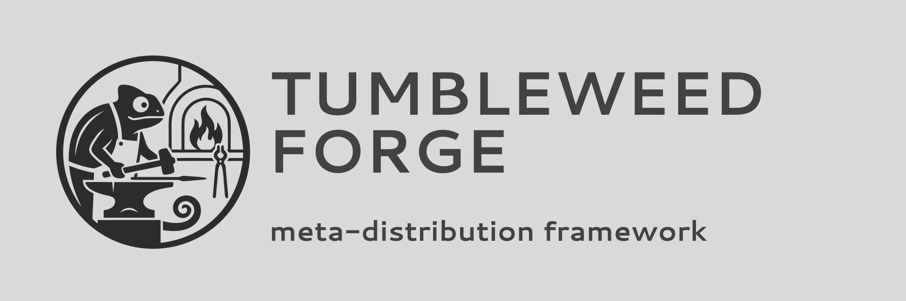

<p align="center">
  
</p>

# Tumbleweed Forge

A cross-distribution image framework with openSUSE visual identity, built by **OBS + KIWI-ng** — demonstrating the portability of the openSUSE build infrastructure.

```
┌─────────────┐    webhook     ┌──────────┐    auto-rebuild    ┌──────────────┐
│  GitHub Repo │ ────────────► │   OBS    │ ◄────────────────── │  Upstream    │
│  (this repo) │ push to main  │ scheduler│  pkg change         │  repos       │
└─────────────┘                └────┬─────┘                     └──────────────┘
                                    │
              ┌─────────────────────┼─────────────────────┐
              ▼                     ▼                     ▼
     ┌────────────────┐  ┌────────────────┐  ┌────────────────┐
     │ Ubuntu Edition │  │ Debian Edition │  │   ... more     │
     │  (Noble 24.04) │  │ (Bookworm 12)  │  │                │
     └────────┬───────┘  └────────┬───────┘  └────────────────┘
              └─────────┬─────────┘
                        ▼
              ┌───────────────────────────┐
              │  download.opensuse.org    │
              │  (static link, GPG-signed)│
              └───────────────────────────┘
```

## What Is This?

Tumbleweed Forge demonstrates that openSUSE's infrastructure (OBS, KIWI-ng) can build and maintain heterogeneous Linux bases — not just RPM-based ones. The framework produces system images that:

- **Boot like openSUSE** — GRUB theme, Plymouth splash, system identity from openSUSE
- **Feel like the native distro** — each edition preserves its desktop defaults (vanilla GNOME, Ubuntu Dock, DDE, Plasma, pacman)
- **Run any base underneath** — Ubuntu, Debian, Arch, and more via modular base profiles
- **Build on OBS (when upstream repos are mirrored in OBS)** — automatic rebuilds on upstream changes, GPG-signed, static download URLs

## Quick Start

### Local Build

Prerequisites: `kiwi-ng` installed, root/sudo access.

```bash
# Build Ubuntu edition
ci/scripts/build-local.sh ubuntu

# Build Ubuntu edition (native UX)
ci/scripts/build-local.sh ubuntu-native

# Build Debian edition
ci/scripts/build-local.sh debian

# Build Deepin edition
ci/scripts/build-local.sh deepin

# Build KDE Neon edition
ci/scripts/build-local.sh kde-neon

# Build Arch edition
ci/scripts/build-local.sh arch

# Build a Live ISO instead of OEM disk
ci/scripts/build-local.sh debian --profile live
```

Test in QEMU:
```bash
ci/scripts/test-image.sh /path/to/image.raw              # headless smoke test
ci/scripts/test-image.sh /path/to/image.raw --interactive # graphical
```

### OBS Build

See [ci/obs/README-OBS-SETUP.md](ci/obs/README-OBS-SETUP.md) for the full setup guide, or:

```bash
ci/scripts/obs-setup.sh ubuntu Mighty23
```

## Architecture

Tumbleweed Forge uses a **three-layer model** — see [docs/architecture.md](docs/architecture.md) for details.

```
experience/                  Boot Identity Layer (universal)
  overlay/                   Files overlaid onto every image
    boot/grub/themes/        GRUB openSUSE theme
    etc/os-release           Forge identity
    etc/issue                Login banner
    usr/share/wallpapers/    openSUSE wallpapers (available assets)
    usr/share/plymouth/      Boot splash watermark
    opt/forge/               apply-experience.sh (GRUB + Plymouth)
  apply-experience.sh        Master copy of boot identity script

bases/                       Base Layer (distro-specific)
  ubuntu/                    Ubuntu Noble 24.04 LTS
    appliance.kiwi           KIWI image description
    config.sh                GNOME + Dash-to-Dock + Forge identity
    root/                    dconf branding, GDM logo, Dock config
    _constraints             OBS build resources
  ubuntu-native/             Ubuntu Noble 24.04 (native UX)
    appliance.kiwi           Stock Ubuntu identity and defaults (Snap enabled)
    config.sh                Minimal enablement only (no Forge boot identity)
    _constraints             OBS build resources
  debian/                    Debian Bookworm 12
    appliance.kiwi           Full GNOME matching task-gnome-desktop
    config.sh                Vanilla GNOME + wallpaper identity only
    root/                    Minimal dconf (wallpaper), GDM logo
    _constraints             OBS build resources
  deepin/                    Deepin 23 (beige)
    appliance.kiwi           KIWI image description
    config.sh                DDE + LightDM + wallpaper override
    _constraints             OBS build resources
  kde-neon/                  KDE Neon (Ubuntu Noble + latest Plasma)
    appliance.kiwi           Plasma desktop packages
    config.sh                SDDM + Plasma wallpaper + Forge identity
    _constraints             OBS build resources
  arch/                      Arch Linux (rolling)
    appliance.kiwi           KDE Plasma + pacman bootstrap
    config.sh                SDDM + Plasma + pacman mirrors
    editbootinstall_arch.sh  EFI boot patching (Arch-specific)
    iso_boot.template        Custom grub template for Arch
    _constraints             OBS build resources

ci/                          Build Layer
  obs/                       OBS configurations
    project-meta.xml         Shared project metadata
    project-config.txt       Shared project config
    ubuntu/_service           Ubuntu source service
    ubuntu-native/_service    Ubuntu (native UX) source service
    debian/_service           Debian source service
    deepin/_service           Deepin source service
    kde-neon/_service         KDE Neon source service
    arch/_service             Arch source service
  scripts/                   Build automation
    assemble.sh              Merge experience + base into KIWI build dir
    build-local.sh           Local KIWI build with repo injection
    obs-setup.sh             OBS project creation
    test-image.sh            QEMU boot test

docs/                        Documentation
  architecture.md            Three-layer architecture
  ux-conformance.md          Per-distro UX reference matrix
  governance.md              Branding & governance policy

.obs/workflows.yml           GitHub → OBS CI integration
```

## How the Rolling Update Works

Two automatic trigger paths — zero manual intervention:

1. **You push to git** → GitHub webhook → OBS pulls new sources via `obs_scm` → rebuilds image
2. **Upstream pushes a package update** → OBS scheduler detects dependency change → automatic rebuild

## Supported Bases

| Base | Status | Description |
|---|---|---|
| **Ubuntu Noble 24.04** | ✅ Building on OBS | GNOME, snap-free |
| **Ubuntu Native UX (Noble)** | ✅ Building on OBS | Stock Ubuntu identity + Snap |
| **Debian Bookworm 12** | ✅ Building on OBS | GNOME, stability reference |
| **Deepin 23 (beige)** | 🔧 Local builds | DDE (Deepin Desktop Environment), external repo not mirrored on OBS |
| **KDE Neon** | 🔧 Local builds | KDE Plasma 6 (latest stable on Ubuntu LTS), external repo not mirrored on OBS |
| **Arch Linux** | ✅ OBS repos available | KDE Plasma, rolling release, pacman |
| Fedora | Planned | RPM-based, innovation reference |

## OBS Constraints for External APT Repositories

Some editions are currently local-only because their upstream repositories are not available as OBS projects:

- KDE Neon repo: `http://archive.neon.kde.org/user`
- Deepin repo: `https://community-packages.deepin.com/beige`

### Verified behavior

On OBS, KIWI rejects non-`obs://` repository URLs in `appliance.kiwi`:

- `repo url not using obs:/ scheme: http://archive.neon.kde.org/user`
- `repo url not using obs:/ scheme: https://community-packages.deepin.com/beige`

Attempting to add Download-on-Demand (`<download .../>`) repos in a home project fails with:

- `admin rights are required to change projects using remote resources`

So yes, enabling OBS builds for KDE Neon/Deepin requires either:

1. an OBS admin-provisioned DoD/mirror project, or
2. an existing public OBS mirror project to reference via `obs://...`.

## Tech Stack

| Component | Role |
|---|---|
| **OBS** | Central orchestrator — builds, signs, publishes, auto-rebuilds |
| **KIWI-ng** | Image builder — OEM disk (`.raw`) and Live ISO (`.iso`) images |
| **GNOME / Plasma / DDE** | Native desktop environments per distro edition |
| **Agama** | Installer (future phase) |

## Downloads

Built images are published on the openSUSE Build Service:

| Edition | OBS Package | Download |
|---|---|---|
| Ubuntu | [tumbleweed-forge-ubuntu](https://build.opensuse.org/package/show/home:Mighty23:TumbleweedForge/tumbleweed-forge-ubuntu) | [images](https://download.opensuse.org/repositories/home:/Mighty23:/TumbleweedForge/images/) |
| Ubuntu (native UX) | _Pending OBS package setup_ | — |
| Debian | [tumbleweed-forge-debian](https://build.opensuse.org/package/show/home:Mighty23:TumbleweedForge/tumbleweed-forge-debian) | [images](https://download.opensuse.org/repositories/home:/Mighty23:/TumbleweedForge/images/) |
| Deepin | _Not on OBS (local builds only)_ | — |
| KDE Neon | _Not on OBS (local builds only)_ | — |
| Arch | _Pending OBS package setup_ | — |

## License

GPL-2.0 — see [LICENSE](LICENSE).
